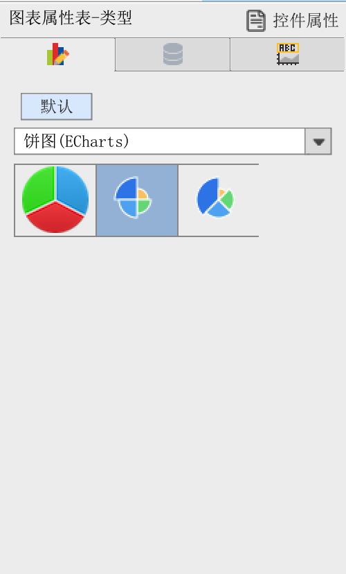
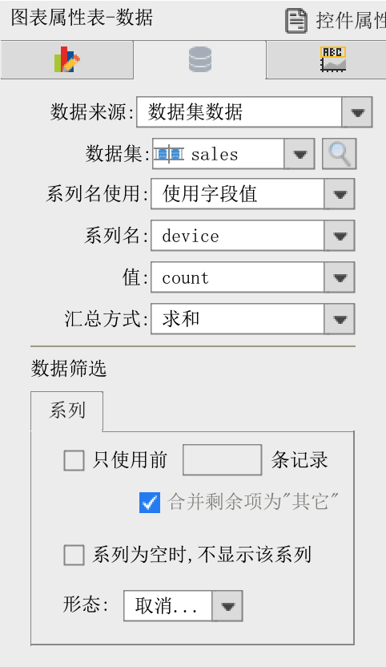
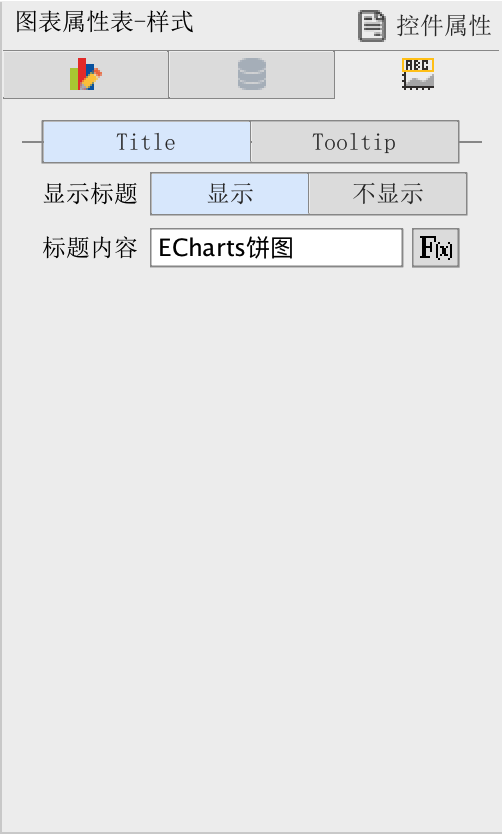
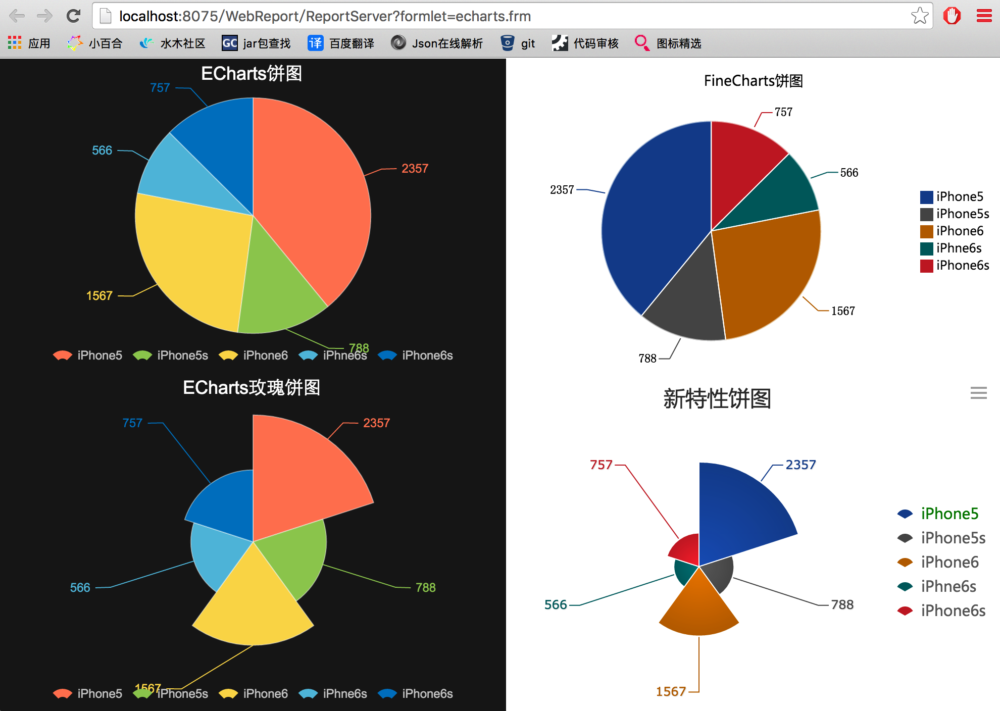

# ECharts插件使用效果和开发文档

## 开发文档
[详细开发文档](document/charts_develop.md)

## 试用效果图
注意:为了对比,需要安装图表(新特性)插件

1. 演示用的模板:tpl/echarts.frm
2. 图表选择界面

3. 图表数据设置界面

4. 图表样式设置界面(目前只有标题设置)

5. 图表预览图,其中左边的两个为黑色主题的ECharts插件效果,右上为FineReport老图表效果,右下为图表(新特性)效果
